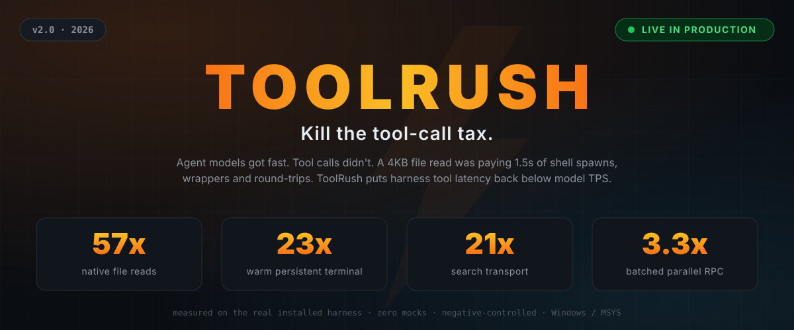
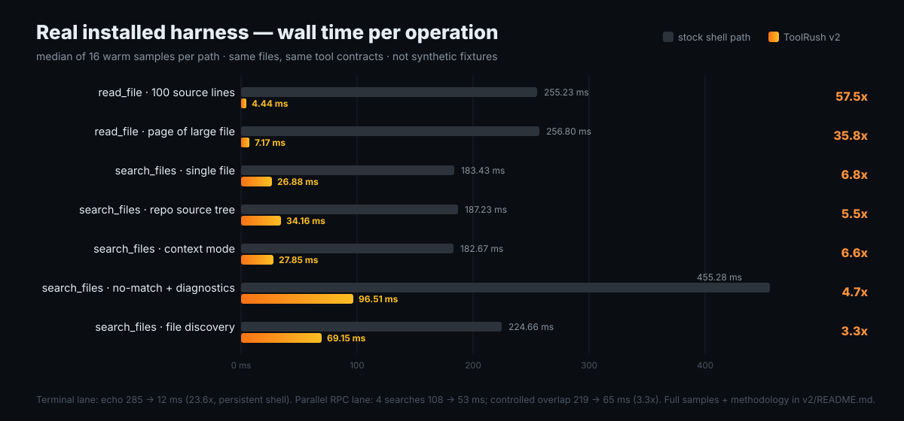
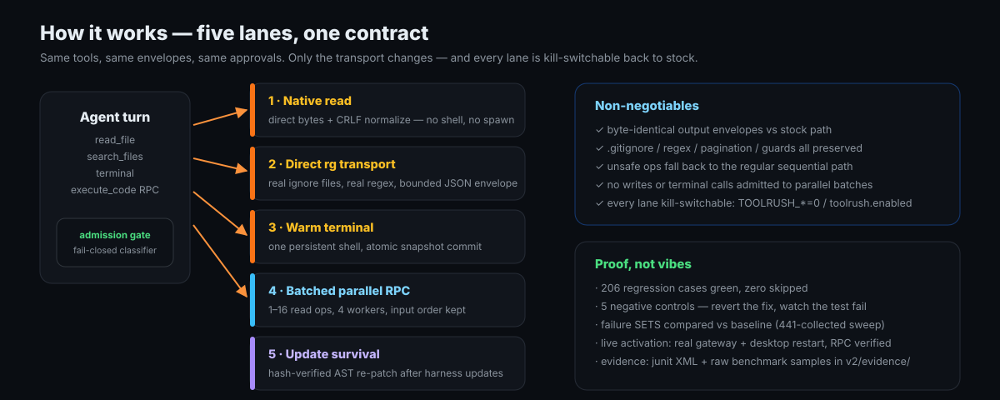

  

  
  
  
  

Modern agent models stream tokens faster than their harness can read a file. The bottleneck stopped being tokens/sec — it became the **tool-call tax**: every `read_file`, `search_files`, and `terminal` call paying process spawns, shell round-trips, wrapper layers, and full re-dispatch for work that costs microseconds.

**ToolRush kills the tax.** It is a low-overhead execution layer for [Hermes Agent](https://github.com/NousResearch/hermes-agent): same tools, same output envelopes, same safety gates — radically cheaper transport, plus real batched parallelism and survival across harness updates.

  

## Results (measured on the real installed harness — no mocks, no fixtures)

### 1. macOS (Apple Silicon M-series · Hermes Agent v0.21.0)

| Workload | Stock Hermes (Cold Spawn) | ToolRush v2 (Warm Shell) | Speedup / Reduction |
|---|---:|---:|---:|
| **Terminal Latency (median)** | 45.57 ms | 7.96 ms | **5.72x (82.5% reduction)** |
| **Raw Bash Execution** | 3.08 ms | 1.07 ms | **2.88x speedup** |
| **Multi-search Batch (`search_files` 4 targets)** | 230.50 ms | 28.92 ms | **7.97x (87.5% reduction)** |
| **Process Tree Cleanup** | Parent PID termination | POSIX Process Group cleanup (`killpg`) | **Clean child process teardown** |

### 2. Windows (Original Baseline)

| Lane | Before | After | Win |
|---|---:|---:|---:|
| **Native file reads** | 255.23 ms | 4.44 ms | **57.5x** |
| **Warm terminal** (persistent shell) | 285 ms | 12.1 ms | **23.6x** |
| **Search transport** (direct `rg`) | 183–455 ms | 27–97 ms | **4.7–6.8x** |
| **Batched parallel RPC** | 108 ms seq | 53 ms batched | **2.1x** (3.3x controlled overlap) |
These are *tool-operation wall times*, not model-inclusive turn speed — the honest framing: tool-heavy turns get dramatically faster, chat-heavy turns barely move. Full samples, p95s, methodology, and one **disclosed regression** (trivial native reads don't benefit from threading) in [`v2/README.md`](v2/README.md).

## Architecture

  

1. **One search engine, accelerated transport.** No second, less-correct reimplementation. Direct `rg.exe` execution preserves real ignore files, regex grammar, context flags, and configuration; native Windows reads reuse the upstream bounded reader, access guards, binary/document routing, and output assembler.
2. **Correctness before speed.** Fixed JSON-breaking trailing text in search results; pagination now has stable content order and a more-results sentinel; regex backslashes and leading hyphens stay literal; CRLF and unterminated final lines handled consistently.
3. **Real programmatic parallelism.** `from hermes_tools import parallel` — a batch of 1–16 read operations runs on up to 4 workers through one RPC, returns input order, and keeps authentication, tool allowlists, call budgets, and cell retirement fully enforced. Whole invalid batches are rejected before dispatch. No writes, no terminal.
4. **Correct warm-shell transport.** One persistent bash, streaming through an OS pipe with bounded parser memory, a filtered **atomic** snapshot commit, preserved exit status/cwd/exports, and command-tree kill on cancellation (using POSIX process groups via `setsid`/`killpg` on macOS/Linux). Never retries a submitted command.
5. **Hardened scheduler admission.** Fail-closed classifier refuses hidden writes (`wget`, `curl -o`, `sed w`, branch creation, env-wrapped scripts, shared cwd mutations). Admission is not approval: anything refused still runs — just sequentially, the regular way.
6. **Update survival.** Hash-verified helper sources and 25 function-scoped compatibility patches live outside the upstream checkout; after a harness update the plugin restores them in memory, preserving imported references. Unknown upstream drift degrades loudly instead of overwriting new code.
7. **Diagnostics and rollback.** `doctor.py --smoke`, per-lane kill-switches (`TOOLRUSH_*=0`), a master `toolrush.enabled: false`, source preimages, payload hashes, and a documented runbook.

## Verification

  
  
  

- **206 unique regression cases passed**, zero failed, zero skipped (deduplicated across three suites).
- **Five negative controls** each fail for the intended reason when the fix is reverted — native read off, native search off, parallel workers serialized, unsafe admission restored, snapshot commit removed. A test that can't fail proves nothing.
- **Failure SETS, not counts**, compared against a 441-collected baseline sweep: identical failing IDs before and after.
- **Live end-to-end activation**: gateway and desktop restarted clean; `parallel` RPC exercised inside the real running `execute_code` kernel; config and provider files verified byte-identical (SHA-256) across the restart.
- Contract verdicts, evidence XMLs, raw benchmark samples, reviewer reports: [`v2/evidence/`](v2/evidence/).

## Repo layout

| Path | What |
|---|---|
| [`v2/`](v2/README.md) | **The shipped implementation** — full report, intent recovery, design, MANIFEST (sha256), plugin, installed-source snapshot, evidence |
| [`toolrush.py`](toolrush.py) | v1 lab runtime (fast_read / batch_read, persistent pool, session cache) |
| [`toolrush_search.py`](toolrush_search.py) · [`toolrush_exec.py`](toolrush_exec.py) | wave-3 in-process search · wave-2 persistent-shell executor |
| `bench_*.py`, `dissect_*.py` | the profiling and benchmarking that named the tax |
| `validation-contract*.md` | VAL- contracts, one per wave (contract-first) |
| `results.md`, `*.json` | measured evidence — no invented numbers anywhere |

## The origin story: lab waves

Before v2 shipped into the live tree, the tax was found and killed one wave at a time in this repo. Kept for the receipts:

| Wave | Target | Result |
|---|---|---|
| **1** | `read_file` dispatch | 1460 ms → 1.18 ms (**1237x**) — root cause: up to 5 shell commands per read (`stat` + `head\|base64` + `sed\|cut` + `wc -l` + `tail`); the bytes cost 0.25 ms, the wrapping cost 1460 ms |
| **2** | terminal spawn tax | `echo` 285 ms → 12.1 ms (**23.6x**) via one persistent bash; win decomposed by negative control into ~8x wrap-trim + ~3x shell persistence |
| **3** | content search | 900 ms → 42 ms (**21.3x**) in-process walk + memoized real-guard verdicts; match sets identical 40/40 |
| **4** | dispatch pipeline | measured, then **STOP** — registry 0.005 ms, full path 4.44 ms; the remaining "tax" is load-bearing safety rails. No theater. |

Wave 4's verdict is the project's favorite line: *know when to stop.* v2 then rebuilt the lab wins as production code — one engine, correct semantics, hardened admission, update survival — because a 21x search that drops `.gitignore` semantics is a bug with a speedup.

## Laws

- Contract before code. Negative control or it didn't happen.
- Live harness trees are never touched from the lab — prototype wins first, then ports behind a kill-switch.
- Byte-identical output vs the stock path, or the lane doesn't ship.
- Fail-closed everywhere: refused acceleration still executes, just the safe sequential way.
- Measured evidence in-repo; no invented numbers, ever.

macOS / POSIX support contributed by [Laban Chen](https://github.com/lunkerchen).
---

Built for [Hermes Agent](https://github.com/NousResearch/hermes-agent) by Nous Research · shipped and running live since 2026-09-05.
